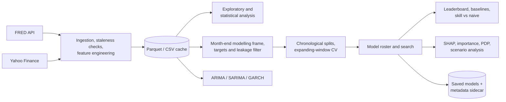

# Monetary Policy Analyzer

**From macro data to forecasts you can inspect.**

[](https://github.com/m-markowski/Monetary-Policy-Analyzer/actions/workflows/ci.yml)

A Python/Streamlit research application for **US and euro-area macroeconomic and financial analysis**. It combines data ingestion, feature engineering, statistical diagnostics, time-aware model evaluation, explainability and scenario analysis in one workflow.

Instead of stitching together downloads, cleaning scripts and separate notebooks, users can explore the economic backdrop, compare forecasts against simple baselines, and inspect what drives a prediction.

## Run locally

The launcher and locked environment support Windows 10/11 only. No preinstalled Python is needed.

1. Clone the repository, or use **Code > Download ZIP** and extract it.
2. Create a FRED account and generate your own [API key](https://fred.stlouisfed.org/docs/api/api_key.html).
3. Double-click **`start.bat`** and enter the key when prompted. The launcher handles local Python 3.12, dependencies, key validation and startup checks, then opens your browser.
4. Click **Load data** on **Main Page**. Explore the EDA page, or configure a modelling task and click **Train / refit**.

Later launches reuse the environment and key. **Reload data** refreshes datasets. Keep the console open; press **Q** there to stop. Your key stays in Git-ignored `config/.env`; do not share it.


*Scenario analysis with adjustable inputs. Screenshots show example runs, not live forecasts or a fixed benchmark.*

## What this project demonstrates

| Area | Implemented in the project |
| --- | --- |
| **Data engineering** | FRED and Yahoo Finance ingestion with retries and stale-series checks, incremental/full refresh, Parquet/CSV caching and YAML-driven source and feature definitions. |
| **Time-series machine learning** | Forward-change and Hike/Hold/Cut targets, chronological Train/Dev/Test splits with horizon-sized purges, expanding-window CV, in-fold feature selection and scaling, naive baselines and randomised/Optuna search over linear, SVM, tree, boosting and Keras models. |
| **Statistical and econometric analysis** | Distribution and normality diagnostics, group comparisons, VIF and partial correlations, stationarity and cointegration, PCA/K-means structure, OLS/logit baselines, ARIMA/SARIMA and GARCH with holdout backtests. |
| **Model evaluation and explainability** | Leaderboards across splits, skill vs no-change, Brier/log loss, Youden thresholds, native and permutation importance, tree SHAP, partial dependence and scenario sensitivity. |
| **Software engineering** | Locked dependencies (`uv.lock`), automated Windows bootstrap with repository-local Python, compatibility-checked model persistence, modular UI/data/modelling layers, unit tests and CI. |

<details>
<summary><strong>More screenshots: model comparison, feature importance and forecasting</strong></summary>

### Model comparison

The highlighted base model is selected on the Dev dataset.


### Feature importance

Scaled bars show which inputs the fitted model relies on most under the selected importance measure.


### Forecasting a single series

ARIMA/SARIMA projections include a model-based 95% prediction interval.


</details>

## What you can do

| Workflow | What the application provides |
| --- | --- |
| **Explore macro and markets** | Inspect rates, inflation, growth and market series; examine distributions, relationships, stationarity, cointegration and regime differences. |
| **Compare forecasts** | Estimate net policy-rate direction (**Hike / Hold / Cut**) over 1-12 months, or changes in selected macro series. Compare statistical, machine-learning and neural models. |
| **Explain and challenge predictions** | Inspect residuals, class probabilities, feature importance, tree SHAP and partial dependence; vary inputs through scenario controls. |
| **Forecast levels and volatility** | Use ARIMA/SARIMA for a single series' level and GARCH for the conditional volatility of its monthly changes, with separate historical holdout checks. |

## Architecture



## Research design

- Model search uses monthly snapshots and expanding-window validation with horizon-sized gaps. Feature selection and scaling stay inside each training fold. Regression targets forward changes, not trending levels.
- Train fits and tunes base models; Dev selects the winner and fits ensembles; Test evaluates them. No-change, majority-class and trailing-momentum baselines make a lack of improvement visible.
- YAML-defined sources and features, API retries, stale-series checks, incremental/full refresh, Parquet/CSV caches and compatibility-checked model persistence support repeated analysis.

<details>
<summary><strong>Under the hood</strong></summary>

**Models:** linear/logistic regression and regularised variants, SVM/SVR, trees, random forests, gradient boosting, XGBoost, LightGBM, blends and stacking. Randomised search or Optuna tune classical models; TensorFlow/Keras MLP and LSTM models use fixed architectures and early stopping inside Train.

```text
app/           Streamlit pages
config/        Data sources, feature definitions and settings
src/           Data preparation and modelling logic
src/models/    Targets, training, ensembles, evaluation and explanations
utils/         Statistics, charts and interpretation text
scripts/       Windows environment bootstrap
tests/         Unit tests for the modelling logic
data/          Local datasets and saved models (generated at runtime)
```

**Development:** `uv run pytest` covers target construction, chronological splits and purges, leakage filtering, baselines, probability metrics and model persistence; `uv run ruff check .` lints. Both run in GitHub Actions on every push and pull request.

</details>

## What the results mean

**Historical evaluation is not a point-in-time backtest.** Data uses current revisions and observation dates, not historical publication dates. Forward-filling can therefore introduce look-ahead bias that chronological splits do not resolve. Monthly sampling does not eliminate autocorrelation.

Scenarios measure model sensitivity, not causal economic effects. Direction labels describe net rate changes, not individual Fed/ECB meetings. Results are research outputs.

## Authorship and AI assistance

Developed drawing on my experience in banking and financial markets. My contribution covers the concept, scope, architecture, data and modelling decisions, integration, verification and interpretation. **Claude (Anthropic) and GPT (OpenAI)** supported implementation and code work. I remain responsible for the assumptions and the final application.

## License

The original source code and documentation in this repository are licensed
under the [MIT License](LICENSE).

Third-party libraries and data obtained from FRED and Yahoo Finance remain
subject to their respective licenses and terms of use. The MIT License does
not grant rights to those data or override the providers' terms.
