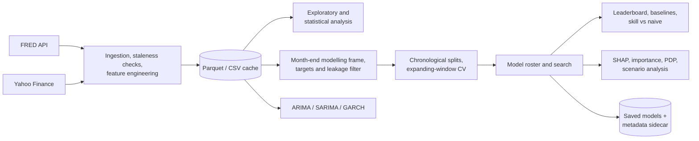

# Monetary Policy Analyzer

**From macro data to forecasts you can inspect.**

[](https://github.com/m-markowski/Monetary-Policy-Analyzer/actions/workflows/ci.yml)

A local Python/Streamlit application for analysing **US and euro-area macroeconomic and financial data**. It connects data preparation, statistical analysis and forecasting, with simple benchmarks to check whether a model adds value.

## Run locally

The launcher and locked environment support Windows 10/11 only. No preinstalled Python is needed.

1. Clone the repository, or use **Code > Download ZIP** and extract it.
2. Create a FRED account and generate your own [API key](https://fred.stlouisfed.org/docs/api/api_key.html).
3. Double-click **`start.bat`** and enter the key when prompted. The launcher handles local Python 3.12, dependencies, key validation and startup checks, then opens your browser.
4. Click **Load data** on **Main Page**. Explore the EDA page, or configure a modelling task and click **Train / refit**.

Later launches reuse the environment and key. **Reload data** refreshes datasets. Keep the console open; press **Q** there to stop. Your key stays in Git-ignored `config/.env`; do not share it.

## Case study: a three-month Fed rate forecast

**The model selected on Dev did not beat "no change" on Test.** SVR achieved a Test RMSE of **0.619 percentage points**, versus **0.570** for "no change". A decision tree did better on Test, but was not selected on Dev; the report keeps that distinction.

**[Read the case study: setup, results, errors and feature importance](docs/case_study_regression.md)**

## Application


*Adjust inputs to inspect model sensitivity. Example interface view, not a live forecast or the case-study result.*

<details>
<summary><strong>View a single-series forecast</strong></summary>


*Example ARIMA/SARIMA forecast with a 95% prediction interval, separate from the supervised-model case study.*

</details>

## What this project demonstrates

| Area | Implemented in the project |
| --- | --- |
| **Data engineering** | FRED and Yahoo Finance ingestion with retries and stale-series checks, incremental/full refresh, Parquet/CSV caching and YAML-driven source and feature definitions. |
| **Time-series machine learning** | Forward-change and Hike/Hold/Cut targets, chronological Train/Dev/Test splits with horizon-sized purges, expanding-window CV, in-fold feature selection and scaling, naive baselines and randomised/Optuna search over linear, SVM, tree, boosting and Keras models. |
| **Statistical and econometric analysis** | Distribution and normality diagnostics, group comparisons, VIF and partial correlations, stationarity and cointegration, PCA/K-means structure, OLS/logit baselines, ARIMA/SARIMA and GARCH with holdout backtests. |
| **Model evaluation and explainability** | Leaderboards across splits, skill vs no-change, Brier/log loss, Youden thresholds, native and permutation importance, tree SHAP, partial dependence and scenario sensitivity. |
| **Software engineering** | Locked dependencies (`uv.lock`), automated Windows bootstrap with repository-local Python, compatibility-checked model persistence, modular UI/data/modelling layers, unit tests and CI. |

## Architecture



<details>
<summary><strong>Under the hood: models, code and development checks</strong></summary>

**Models:** linear/logistic regression and regularised variants, SVM/SVR, decision trees, random forests, gradient boosting, XGBoost, LightGBM, blending and stacking. Randomised search or Optuna tune classical models; optional TensorFlow/Keras MLP and LSTM models use fixed architectures and early stopping inside Train.

**Selection:** Train fits and tunes base models; Dev selects the winner and fits Blend/Stack; Test evaluates the result. Ensembles are excluded from winner selection because their combination layers are fitted on Dev.

```text
app/           Streamlit pages
config/        Data sources, feature definitions and settings
src/           Data preparation and modelling logic
src/models/    Targets, training, ensembles, evaluation and explanations
utils/         Statistics, charts and interpretation text
scripts/       Windows environment bootstrap
tests/         Unit tests for the modelling logic
.github/       GitHub Actions workflow
docs/          Case study
data/          Local datasets and saved models (generated at runtime)
```

**Development:** `uv run pytest -q` checks target construction, chronological splits and gaps, target-family filtering, baselines, probability metrics and model persistence. `uv run ruff check .` runs linting.

Both run in [GitHub Actions](.github/workflows/ci.yml) on Windows for pull requests and pushes to `main`. CI does not test the full interactive launcher or live data downloads. Dependencies are locked in `uv.lock`.

</details>

## Limits

**Historical evaluation is not a point-in-time backtest:** data contains revisions and is not aligned to historical release dates. Chronological splits do not resolve these limitations, and monthly sampling does not eliminate autocorrelation.

Scenarios and feature importance are not causal estimates. Direction labels describe net rate changes, not individual Fed/ECB meetings.

## Authorship and AI assistance

Developed drawing on my experience in banking and financial markets. My contribution covers the concept, scope, architecture, data and modelling decisions, integration, verification and interpretation. **Claude (Anthropic) and GPT (OpenAI)** supported implementation and code work. I remain responsible for the assumptions and the final application.

## License

The original source code and documentation in this repository are licensed
under the [MIT License](LICENSE).

Third-party libraries and data obtained from FRED and Yahoo Finance remain
subject to their respective licenses and terms of use. The MIT License does
not grant rights to those data or override the providers' terms.
